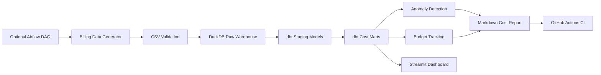
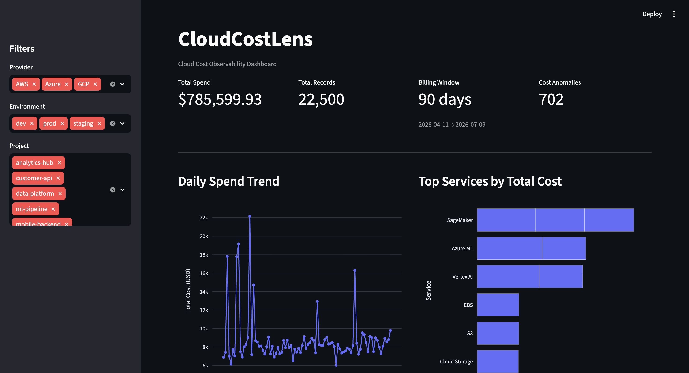
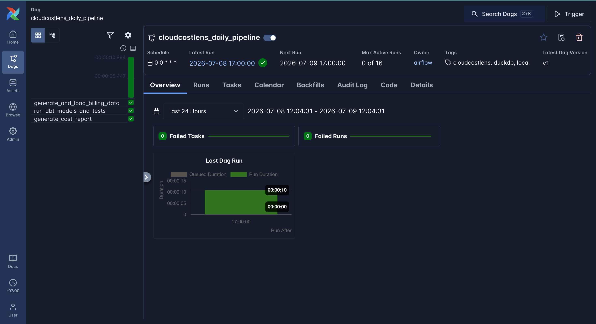

# CloudCostLens

[](https://github.com/asnoori915/cloudcostlens/actions/workflows/ci.yml)

CloudCostLens is a data engineering and analytics engineering portfolio project for cloud cost observability.

It generates realistic multi-cloud billing data, validates and loads it into a local analytics warehouse, transforms usage records with dbt, produces a Markdown cost report, and visualizes spend trends, budget status, and cost anomalies in a Streamlit dashboard.

## Why I Built This

Cloud costs are a major operational concern for modern data and software teams. I built CloudCostLens to practice end-to-end analytics engineering: synthetic data generation, warehouse loading, dbt modeling, data quality testing, reporting, and business-facing cost monitoring.

## Architecture Flow



## Current Capabilities

The project currently supports:

- Realistic cloud billing data generation
- Local CSV validation
- DuckDB local analytics warehouse
- dbt staging and mart models
- dbt tests
- Markdown cost summary reporting
- Streamlit cost dashboard
- Optional Airflow DAG for workflow orchestration

## Project Metrics

The default local workflow produces a portfolio-ready sample dataset with:

- **22,500 billing records**
- **7 dbt models**
- **34+ dbt tests**
- A **90-day billing window**
- About **$785K** in simulated cloud spend

Top cost drivers include **ML services** (SageMaker, Vertex AI, Azure ML) and **storage services** (S3, Cloud Storage). The data also includes realistic variation such as higher weekday compute spend, slowly increasing storage costs, occasional ML training spikes, lower dev environment spend, and partially untagged resources.

## Tech Stack

**Current local stack**

- Python
- DuckDB
- dbt (dbt-duckdb)
- Streamlit
- Plotly
- SQL

**Optional orchestration**

- Apache Airflow (separate install via `requirements-airflow.txt`)

**Optional future warehouse path**

Snowflake SQL setup is included in `snowflake/01_create_database_objects.sql` as an optional future warehouse setup. The default local development workflow uses DuckDB and does not require a Snowflake connection.

## Quick Start

Install dependencies:

```bash
python -m venv .venv
source .venv/bin/activate
pip install -r requirements.txt
```

Run the full local workflow:

```bash
python main.py
```

Launch the dashboard:

```bash
streamlit run dashboard/app.py
```

### Individual commands

```bash
python -m ingestion.main
python -m analytics.run_dbt --all
python -m reporting.generate_cost_report
streamlit run dashboard/app.py
```

### What each command does

- `python main.py` — runs ingestion, dbt models/tests, and report generation end to end
- `python -m ingestion.main` — generates billing data, validates the CSV, and loads it into DuckDB
- `python -m analytics.run_dbt --all` — runs dbt models and tests
- `python -m reporting.generate_cost_report` — writes `reports/cloud_cost_summary.md`
- `streamlit run dashboard/app.py` — launches the cost observability dashboard

## Optional Airflow Orchestration

CloudCostLens includes an optional Airflow DAG at `airflow/dags/cloudcostlens_daily_pipeline.py`.

The DAG runs the same core local workflow as `python main.py`:

```text
generate/load billing data → run dbt → generate cost report
```

Airflow is optional and not required for the default local workflow. The recommended way to run the project locally is still:

```bash
python main.py
```

Airflow dependencies are kept separate in `requirements-airflow.txt` so the main project setup stays lightweight.

The DAG was tested locally with `airflow standalone` and successfully ran ingestion, dbt models/tests, and cost report generation.

## Screenshots

### Cloud Cost Dashboard

The Streamlit dashboard summarizes total spend, billing records, billing window, cost anomalies, daily spend trends, top services, project spend, budget status, and raw billing samples.



### Airflow Orchestration

The optional Airflow DAG successfully orchestrates the local workflow: billing data generation/loading, dbt models/tests, and Markdown report generation.



## Project Structure

```text
ingestion/          Billing data generation, validation, and DuckDB loading
analytics/          dbt runner helper
dbt_cloudcostlens/  dbt staging and mart models
reporting/          Markdown cost report generation
dashboard/          Streamlit dashboard
airflow/            Optional Airflow DAG
data/               Local CSV and DuckDB warehouse
reports/            Generated cost summary reports
snowflake/          Optional Snowflake warehouse setup SQL
docs/               Architecture notes
```

## dbt Models

**Staging**

- `stg_cloud_usage`
- `stg_projects`
- `stg_services`

**Marts**

- `fact_daily_cloud_cost`
- `mart_service_spend`
- `mart_budget_tracking`
- `mart_cost_anomalies`

## Future Enhancements

- Snowflake loading and dbt target switch

## Project Status

Core local pipeline is working: data generation, validation, DuckDB loading, dbt transformations, tests, cost reporting, and dashboard visualization.
